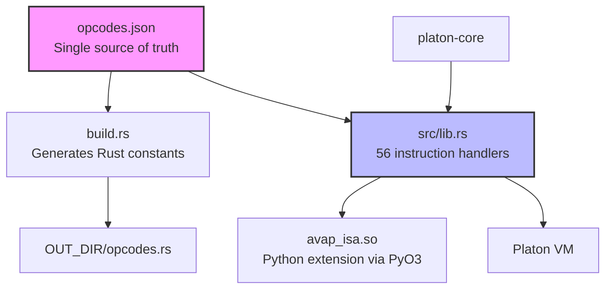
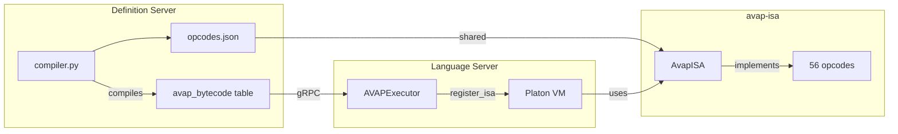
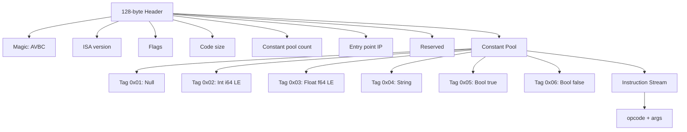

# avap-isa

**AVAP Instruction Set Architecture for the Platon kernel**

[](https://opensource.org/licenses/MIT)
[](https://www.rust-lang.org)
[](https://pyo3.rs)
[](https://www.python.org)

**Author:** Rafael Ruiz (101OBEX, Corp - CTO)

---

## What is avap-isa?

`avap-isa` is the reference implementation of the instruction set architecture (ISA) for the AVAP language, designed for the [Platon](https://github.com/avapcloud/platon) virtual machine kernel. It provides 56 opcodes that cover all Python constructs used in AVAP command definitions — compiled to AVBC bytecode and executed natively by the Rust VM with no `exec()` at runtime.

**Problem it solves:**
- Eliminates Python `exec()` from the critical execution path
- Provides a sandboxed execution model with timeout and instruction limits
- Makes the AVAP language implementation-agnostic
- Enables any language that compiles to AVBC to run on Platon

**Who is this for?**
- Developers working with the AVAP framework
- Contributors who want to extend the ISA with new opcodes
- Architects studying language-agnostic VM designs

---

## Documentation

This section provides an organized guide through all project documentation.

### Quick Start

To get started quickly with avap-isa:

1. **Installation** - See [Installation](#installation) section below
2. **Quick Start** - Basic usage example in [Quick Start](#quick-start)
3. **First steps** - Read [CONTRIBUTING.md](./CONTRIBUTING.md) to set up your development environment

### Main Guides

**AVAP Language Specification**
- [docs/language-spec.md](./docs/language-spec.md) - Complete AVAP language specification, including type system, program structure, available commands, and full examples.

**Instruction Reference (Opcodes)**
- [opcodes.json](./opcodes.json) - Complete definition of all 56 opcodes in JSON format (single source of truth)
- [CHANGELOG.md](./CHANGELOG.md) - Detailed opcode list by category with introduction dates

**AVBC Bytecode Format**
- [ARCHITECTURE.md](./ARCHITECTURE.md#avbc-bytecode-compilation) - Section on bytecode compilation
- [README.md](#avbc-bytecode-format) - Detailed header and constant pool format (below)

### Architecture

**Overview**
- [ARCHITECTURE.md](./ARCHITECTURE.md) - Architecture diagrams, ISA registration protocol, runtime connector routing, and opcode lifecycle

**Architecture Decision Records (ADRs)**
- [docs/ADR/ROADMAP.md](./docs/ADR/ROADMAP.md) - Index of all Architecture Decision Records
  - [ADR-001](./docs/ADR/ADR-001-three-crate-workspace.md) - Three-Crate Rust Workspace Architecture
  - [ADR-002](./docs/ADR/ADR-002-isa-external-plugin.md) - ISA as External Plugin via ISAProvider Trait
  - [ADR-003](./docs/ADR/ADR-003-opcodes-json-single-source-of-truth.md) - opcodes.json as Single Source of Truth
  - [ADR-004](./docs/ADR/ADR-004-dual-bytecode-storage.md) - Dual Bytecode Storage for Backwards Compatibility
  - [ADR-005](./docs/ADR/ADR-005-compiler-in-definition-server.md) - Python->AVBC Compiler in Definition Server
  - [ADR-006](./docs/ADR/ADR-006-marker-based-conector-routing.md) - Marker-Based Routing for Conector Namespace Mutations
  - [ADR-007](./docs/ADR/ADR-007-maturin-build-docker-pattern.md) - maturin build + pip install wheel Pattern for Docker
  - [ADR-008](./docs/ADR/ADR-008-short-circuit-boolean-evaluation.md) - Short-Circuit Boolean Evaluation in the Compiler
  - [ADR-009](./docs/ADR/ADR-009-isinstance-to-is-instance-opcode.md) - isinstance() Compiles to IS_INSTANCE Opcode

**Product Requirements (PRD)**
- [docs/PRD/PRD-001-platon-vm-kernel-avap-isa-v2.md](./docs/PRD/PRD-001-platon-vm-kernel-avap-isa-v2.md) - Complete Product Requirements Document with goals, requirements, architecture, and rollout plan

### Development

**Contributing**
- [CONTRIBUTING.md](./CONTRIBUTING.md) - Complete guide for contributors, including setup, how to add opcodes, coding standards, commit messages, and PR process

**Coding Standards**
- [CONTRIBUTING.md#coding-standards](./CONTRIBUTING.md#coding-standards) - Rust fmt, error handling, documentation
- [CONTRIBUTING.md#commit-messages](./CONTRIBUTING.md#commit-messages) - Commit convention (Conventional Commits)

**How to Add an Opcode**
- [CONTRIBUTING.md#adding-a-new-opcode](./CONTRIBUTING.md#adding-a-new-opcode) - Step-by-step tutorial with code examples

### Security

**Security Policy**
- [SECURITY.md](./SECURITY.md) - How to report vulnerabilities, supported versions, response times

**Security Model**
- [SECURITY.md#security-model](./SECURITY.md#security-model) - What avap-isa guarantees, what it does NOT guarantee, `unsafe` usage

### Project

**Changelog**
- [CHANGELOG.md](./CHANGELOG.md) - Complete change history following Keep a Changelog

**Roadmap**
- [CHANGELOG.md#unreleased](./CHANGELOG.md#unreleased) - Planned features (disassembler, benchmarks, WASM)
- [docs/ADR/ROADMAP.md](./docs/ADR/ROADMAP.md) - Architectural decisions that define the roadmap

**License**
- [LICENSE](./LICENSE) - MIT License

**Code of Conduct**
- [CODE_OF_CONDUCT.md](./CODE_OF_CONDUCT.md) - Contributor Covenant 2.1

---

## Site Map

| Document | Description | Audience |
|----------|-------------|----------|
| [README.md](./README.md) | Main portal and documentation index | Everyone |
| [ARCHITECTURE.md](./ARCHITECTURE.md) | Internal architecture diagrams and explanation | Developers, Architects |
| [docs/language-spec.md](./docs/language-spec.md) | Complete AVAP language specification | Developers, Users |
| [opcodes.json](./opcodes.json) | Definition of 56 opcodes (single source of truth) | Developers, Compiler |
| [CONTRIBUTING.md](./CONTRIBUTING.md) | Guide for contributors | Contributors |
| [SECURITY.md](./SECURITY.md) | Security policy and model | Security researchers, Users |
| [CHANGELOG.md](./CHANGELOG.md) | Change history | Everyone |
| [CODE_OF_CONDUCT.md](./CODE_OF_CONDUCT.md) | Code of conduct | Community |
| [docs/ADR/ROADMAP.md](./docs/ADR/ROADMAP.md) | Index of Architecture Decision Records | Architects, Developers |
| [docs/PRD/PRD-001.md](./docs/PRD/PRD-001-platon-vm-kernel-avap-isa-v2.md) | Product Requirements Document | PM, Architects |
| [docs/commands-reference.json](./docs/commands-reference.json) | AVAP command reference | Developers |

---

## Requirements

| Dependency | Version |
|------------|---------|
| Rust | 1.75+ |
| Python | 3.11+ |
| maturin | 1.5+ |
| platon-core | 0.3+ |

---

## Installation

### From source (development)

```bash
git clone https://github.com/avapcloud/avap-isa
cd avap-isa
maturin develop --release
```

### In a Docker container

```dockerfile
# Mount alongside platon and build at startup
volumes:
  - ../PLATON:/build/PLATON
  - ../avap-isa:/build/avap-isa
```

---

## Quick Start

```python
from platon import VM
from avap_isa import AvapISA

vm = VM(timeout=5.0)
vm.register_isa(AvapISA())
vm.load(avbc_bytecode)
result = vm.execute()
```

### ISA introspection

```python
isa = AvapISA()
print(isa)            # <AvapISA v0.1.0 (56 opcodes)>
print(isa.name)       # "AVAP-ISA"
print(isa.version)    # (0, 1, 0)
```

---

## Architecture



`avap-isa` implements the `ISAProvider` trait from `platon-core`, making it a first-class, swappable ISA for any language targeting the Platon kernel. Opcode values are never hardcoded in source — they are always derived from `opcodes.json`.

For a detailed architecture explanation, see [ARCHITECTURE.md](./ARCHITECTURE.md).

### System Architecture



---

## Instruction Set

All instructions are defined in [opcodes.json](./opcodes.json). Each instruction argument is a `u32` little-endian value immediately following the opcode byte (4 bytes per argument).

For a complete reference of all 56 instructions organized by category, see the original documentation below or [CHANGELOG.md](./CHANGELOG.md) for the list with dates.

### Category Summary

| Category | Opcodes | Range |
|----------|---------|-------|
| Stack & Variables | 7 | 0x00-0x41 |
| Arithmetic | 7 | 0x10-0x16 |
| Comparison | 10 | 0x20-0x29 |
| Boolean | 2 | 0x2A-0x2B |
| Control Flow | 9 | 0x30-0x38 |
| Iteration | 2 | 0x3A-0x3B |
| Object Access | 5 | 0x50-0x54 |
| Collections | 3 | 0x55-0x57 |
| Calls | 3 | 0x60-0x62 |
| Runtime | 4 | 0x70-0x90 |
| Type System | 3 | 0x80-0x82 |
| System | 1 | 0xFF |

**Total: 56 opcodes**

For the complete table with mnemonics, opcodes, arguments, and descriptions, consult the [Instruction Set Reference](#instruction-set-reference) section below.

---

## AVBC Bytecode Format



### Header Structure

```
Offset  Size  Field
------  ----  --------------------------
0       4     Magic: b'AVBC'
4       2     ISA version major.minor (u16 LE)
6       2     Flags (u16 LE, reserved = 0)
8       4     Code size in bytes (u32 LE)
12      4     Constant pool entry count (u32 LE)
16      4     Entry point IP (u32 LE, usually 0)
20      108   Reserved (zero-padded to 128 bytes)
128     var   Constant pool
var     var   Instruction stream
```

### Constant Pool Tags

| Tag | Type | Payload |
|-----|------|---------|
| 0x01 | Null | (none) |
| 0x02 | Int | 8 bytes, i64 LE |
| 0x03 | Float | 8 bytes, f64 LE |
| 0x04 | String | 4-byte length (u32 LE) + UTF-8 bytes |
| 0x05 | Bool true | (none) |
| 0x06 | Bool false | (none) |

---

## Instruction Set Reference

### Stack & Variables

| Mnemonic | Opcode | Args | Description |
|----------|--------|------|-------------|
| `NOP` | 0x00 | 0 | No operation |
| `PUSH` | 0x01 | 1 | Push constant[const_idx] onto stack |
| `POP` | 0x02 | 0 | Discard top of stack |
| `DUP` | 0x03 | 0 | Duplicate top of stack |
| `LOAD_NONE` | 0x04 | 0 | Push Null onto stack |
| `LOAD` | 0x40 | 1 | Push globals[name_idx] onto stack |
| `STORE` | 0x41 | 1 | Pop and store into globals[name_idx] |

### Arithmetic

| Mnemonic | Opcode | Args | Description |
|----------|--------|------|-------------|
| `ADD` | 0x10 | 0 | pop b, pop a, push a+b |
| `SUB` | 0x11 | 0 | pop b, pop a, push a-b |
| `MUL` | 0x12 | 0 | pop b, pop a, push a*b |
| `DIV` | 0x13 | 0 | pop b, pop a, push a/b |
| `MOD` | 0x14 | 0 | pop b, pop a, push a%b |
| `NEG` | 0x15 | 0 | pop a, push -a |
| `NOT` | 0x16 | 0 | pop a, push !a |

### Comparison

| Mnemonic | Opcode | Args | Description |
|----------|--------|------|-------------|
| `EQ` | 0x20 | 0 | pop b, pop a, push a==b |
| `LT` | 0x21 | 0 | pop b, pop a, push a<b |
| `GT` | 0x22 | 0 | pop b, pop a, push a>b |
| `LTE` | 0x23 | 0 | pop b, pop a, push a<=b |
| `GTE` | 0x24 | 0 | pop b, pop a, push a>=b |
| `NEQ` | 0x25 | 0 | pop b, pop a, push a!=b |
| `IN` | 0x26 | 0 | pop container, pop item, push item in container |
| `NOT_IN` | 0x27 | 0 | pop container, pop item, push item not in container |
| `IS` | 0x28 | 0 | pop b, pop a, push a is b |
| `IS_NOT` | 0x29 | 0 | pop b, pop a, push a is not b |

### Boolean

| Mnemonic | Opcode | Args | Description |
|----------|--------|------|-------------|
| `BOOL_AND` | 0x2A | 0 | Short-circuit AND - leaves result on stack |
| `BOOL_OR` | 0x2B | 0 | Short-circuit OR - leaves result on stack |

### Control Flow

| Mnemonic | Opcode | Args | Description |
|----------|--------|------|-------------|
| `JMP` | 0x30 | 1 | Unconditional jump to target_ip |
| `JMP_IF` | 0x31 | 1 | Jump if TOS is truthy (no pop) |
| `JMP_IF_NOT` | 0x32 | 1 | Jump if TOS is falsy (no pop) |
| `JMP_IF_POP` | 0x33 | 1 | Jump if TOS is truthy and pop |
| `JMP_IF_NOT_POP` | 0x34 | 1 | Jump if TOS is falsy and pop |
| `PUSH_TRY` | 0x35 | 1 | Push exception handler at handler_ip |
| `POP_TRY` | 0x36 | 0 | Pop exception handler (normal exit from try) |
| `RAISE` | 0x37 | 0 | Raise TOS as exception |
| `RETURN` | 0x38 | 0 | Return TOS from current function |

### Iteration

| Mnemonic | Opcode | Args | Description |
|----------|--------|------|-------------|
| `GET_ITER` | 0x3A | 0 | Pop iterable, push iterator |
| `FOR_ITER` | 0x3B | 1 | Advance iterator; push next value or jump to exit_ip |

### Object Access

| Mnemonic | Opcode | Args | Description |
|----------|--------|------|-------------|
| `GET_ATTR` | 0x50 | 1 | Pop obj, push obj.attr_name |
| `SET_ATTR` | 0x51 | 1 | Pop value, set obj.attr_name = value |
| `GET_ITEM` | 0x52 | 0 | Pop key, pop obj, push obj[key] |
| `SET_ITEM` | 0x53 | 0 | Pop value, pop key, set obj[key] = value |
| `DELETE_ITEM` | 0x54 | 0 | Pop key, pop obj, del obj[key] |

### Collections

| Mnemonic | Opcode | Args | Description |
|----------|--------|------|-------------|
| `BUILD_LIST` | 0x55 | 1 | Pop n items, push [item0..itemN] |
| `BUILD_DICT` | 0x56 | 1 | Pop 2n items (k,v pairs), push {k:v...} |
| `BUILD_TUPLE` | 0x57 | 1 | Pop n items, push (item0..itemN) |

### Calls

| Mnemonic | Opcode | Args | Description |
|----------|--------|------|-------------|
| `CALL_EXT` | 0x60 | 1 | Call registered native function by func_id |
| `CALL_FUNC` | 0x61 | 1 | Pop n_args + callable, call callable(*args) |
| `CALL_METHOD` | 0x62 | 2 | Pop n_args + obj, call obj.method(*args) |

### Runtime

| Mnemonic | Opcode | Args | Description |
|----------|--------|------|-------------|
| `LOAD_CONECTOR` | 0x70 | 0 | Push runtime connector object onto stack |
| `LOAD_TASK` | 0x71 | 0 | Push current task definition onto stack |
| `LOAD_BUILTIN` | 0x72 | 1 | Push builtin function by name_idx |
| `IMPORT_MOD` | 0x90 | 1 | Push module proxy by name_idx |

### Type System

| Mnemonic | Opcode | Args | Description |
|----------|--------|------|-------------|
| `IS_INSTANCE` | 0x80 | 0 | Pop type (or tuple of types), pop obj, push isinstance result |
| `IS_NONE` | 0x81 | 0 | Pop obj, push obj is None |
| `TYPE_OF` | 0x82 | 0 | Pop obj, push type name string |

### System

| Mnemonic | Opcode | Args | Description |
|----------|--------|------|-------------|
| `HALT` | 0xFF | 0 | Stop execution |

---

## Extending the ISA

`avap-isa` is the **reference implementation** for Platon ISAs. To create an ISA for another language:

1. Create your own `opcodes.json`
2. Depend on `platon-core` for `ISAProvider`, `VMState`, `InstructionSet`
3. Implement instruction handlers as `InstructionFn` functions
4. Register them in `ISAProvider::instruction_set()`

```rust
use platon_core::{ISAProvider, InstructionSet, VMState, ISAError};

pub struct MyISA { isa: InstructionSet }

impl ISAProvider for MyISA {
    fn name(&self)            -> &str         { "my-isa" }
    fn version(&self)         -> (u8, u8, u8) { (1, 0, 0) }
    fn instruction_set(&self) -> &InstructionSet { &self.isa }
}
```

---

## Contributing

See [CONTRIBUTING.md](./CONTRIBUTING.md).

## Security

See [SECURITY.md](./SECURITY.md).

## Changelog

See [CHANGELOG.md](./CHANGELOG.md).

## License

MIT - see [LICENSE](./LICENSE).

**Author:** Rafael Ruiz (101OBEX, Corp - CTO)

Copyright (c) 2026 AVAP Cloud